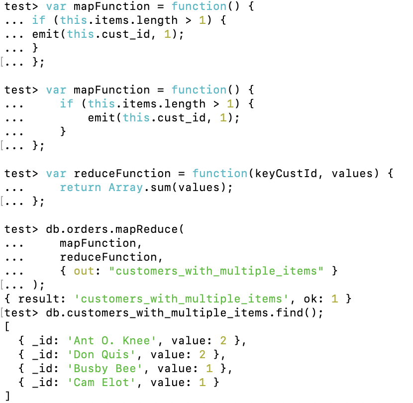

## Validation

## Experiment 1

### Insert documents
Added documents using MongoDB compass, like in the tutorial: 

Inserted one document: 

Found the inserted document: 

### Query documents
Find documents by specifying AND conditions, OR conditions and both. 

### Update documents
Update first documents where item equals paper
 
Update all documents where qty is less than 50
 
Replace the first document from the collection where item is paper.

### Delete documents
Remove all documents where the status field equals "A"
 
Delete the first document where status is "D"

### Bulk write 
Run multiple operations 

## Experiment 2

### First example

### Second example

### Own function 

This function is useful as it analyzes customer purchasing by finding the customers who ordered multiple items. 
Also, it could show which customers shops the most. 

## Technical problems

Installing MongoDB went okay, but without MongoDB compass I got a bit confused as to how to use it. 
Also, encountered a problem during experiment 2, where I tried to do it in local as experiment 2, but that didn't work. 
Changed to a new database. 

