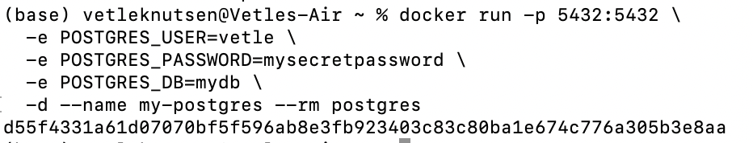
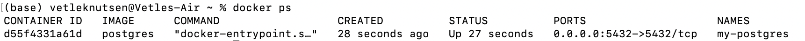

### Set up 
Docker was already installed from experiment 1 

### Using a Dockerized application: PostgreSQL
Pullin PostgreSQL went well, and I decided to use port 5432 as this is the standard port for PostgreSQL. 
Then I set an user, password and database name for the environment variables. Like this: 
 

Running *docker ps*:

I connected the database to the IntelliJ database client and it went well, after I figured I needed to change the url of "hibernate.connection.url".
The tests passed after I figured there was an error in the task for the properties. The driver class in the task was wrong.

Then, the schemas was created and I copied the content of the schema.up.sql into the SQL console to create the tables. 

### Building your own dockerized application
I used the temurin image to containerize my application. 
The Dockerfile ended up like this: [Dockerfile]()
